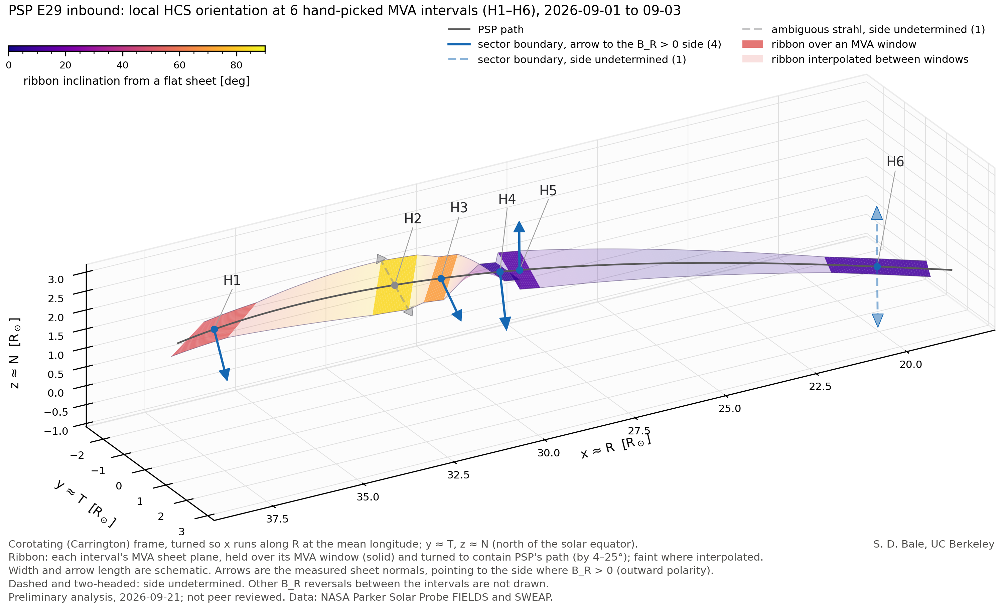
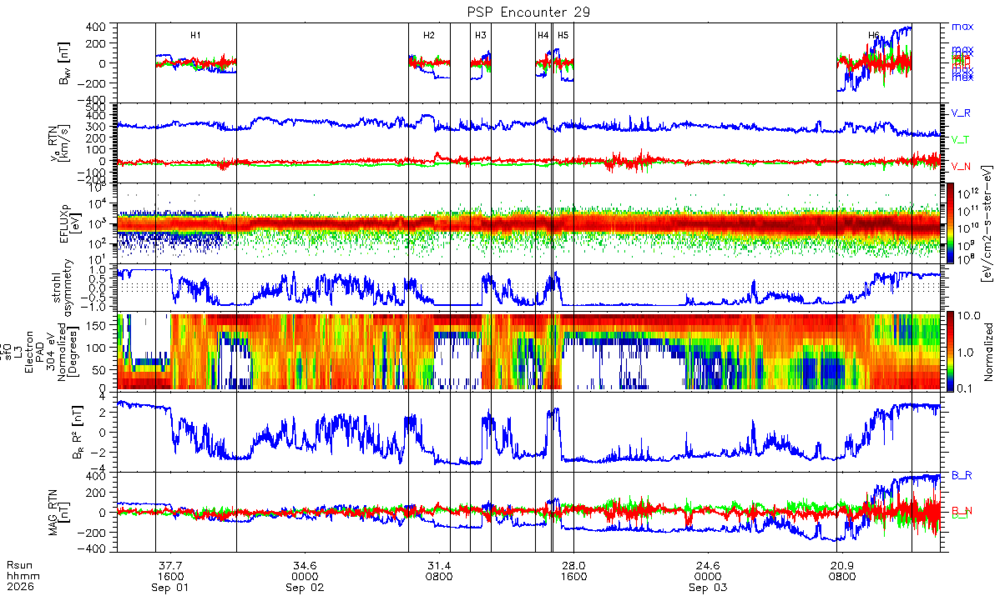

# Parker Solar Probe E29: heliospheric current sheet orientation

An interactive 3-D view of the local orientation of the heliospheric current
sheet (HCS) at six crossings Parker Solar Probe made on the inbound pass of its
29th encounter, 1-3 September 2026, between 37 and 20 solar radii.

**Open the viewer:** https://stuart-bale.github.io/psp-e29-hcs-viewer/

## Reading it

- **Path.** PSP's track in the corotating (Carrington) frame, turned so x runs
  along the radial direction R at the mean longitude; y ≈ T and z ≈ N (north
  of the solar equator).
- **Ribbon.** The current-sheet plane from minimum variance analysis (MVA) of
  the magnetic field over each hand-picked interval, H1-H6. It holds the
  measured orientation over each MVA window (solid) and is interpolated
  between windows (faint). It is turned slightly to contain PSP's path. Its
  colour is the inclination from a flat, equatorial sheet. Width and arrow
  length are schematic.
- **Arrows.** The measured MVA sheet normals. They point across each sheet to
  the side where B_R > 0 (outward polarity); the field itself lies nearly in
  the sheet. That side comes from B_R before and after the crossing and from
  the crossing direction. Dashed, two-headed arrows mark crossings where the
  direction is undetermined.
- **Hand-picked or automated.** Radio buttons under the legend switch between
  the six intervals chosen by eye (H1-H6) and the automated intervals: the
  clear sector boundaries a multiscale MVA scan finds between H1 and H6, where
  the strahl and B_R both reverse (switchbacks and weak-strahl sheets are left
  out). In the automated view the hand-picked windows are grey bands along the
  path.
- **Tick box** under the legend: *arrows show sheet motion past PSP* turns the
  arrows to point the way each sheet moves past the spacecraft instead: the
  sign of the plasma velocity along the normal relative to PSP,
  (V_p − V_sc)·n, from SPAN-i (a current sheet moves with the plasma). Dashed,
  faded arrows then mark sheets moving slower than 20 km/s along the normal,
  within SPAN-i's direction uncertainty.
- **Arrow colour.** Blue: a sector boundary, where the suprathermal electron
  strahl reverses with B_R. Grey: the strahl is too weak to classify.
- **Hover** over a label (H1-H6) for its MVA window, normal, B_R change, the
  flow and spacecraft speeds along the normal, and which side has B_R > 0.

Other B_R reversals between the six intervals are not drawn.

## Time series

The data behind the viewer, 1-3 September 2026. From the top: the field in each
interval's MVA frame; SPAN-i velocity (RTN) and ion energy flux; the strahl
asymmetry and the 304 eV electron pitch-angle distribution; B_R R²; and the
field in RTN. Vertical lines bound the MVA windows, H1-H6.

## Status

Preliminary analysis; not peer reviewed. The page states the date it was built.

## Privacy

Visits to the viewer are counted with GoatCounter, which sets no cookies and
keeps no IP addresses.

## Data

NASA Parker Solar Probe:

- FIELDS fluxgate magnetometer, RTN, 4 samples per cycle
- SWEAP SPAN-i ion moments (L3)
- SWEAP SPAN-e electron pitch-angle distributions (L3)

The page is a single HTML file; it loads plotly.js from the plotly CDN.
